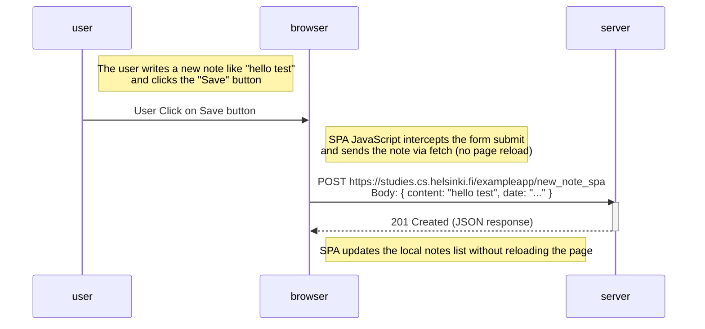

```mermaid
sequenceDiagram
    participant user
    participant browser
    participant server

    Note right of user: The user writes a new note like "hello test"<br>and clicks the "Save" button

    user->>browser: User Click on Save button

    Note right of browser: SPA JavaScript intercepts the form submit<br>and sends the note via fetch (no page reload)

    browser->>server: POST https://studies.cs.helsinki.fi/exampleapp/new_note_spa<br>Body: { content: "hello test", date: "..." }
    activate server
    server-->>browser: 201 Created (JSON response)
    deactivate server

    Note right of browser: SPA updates the local notes list without reloading the page
```
